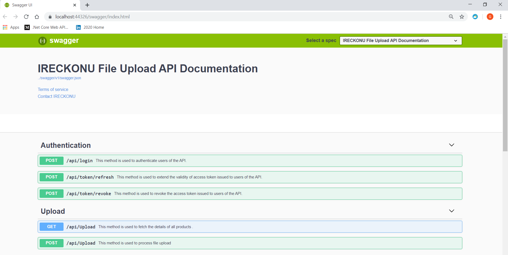
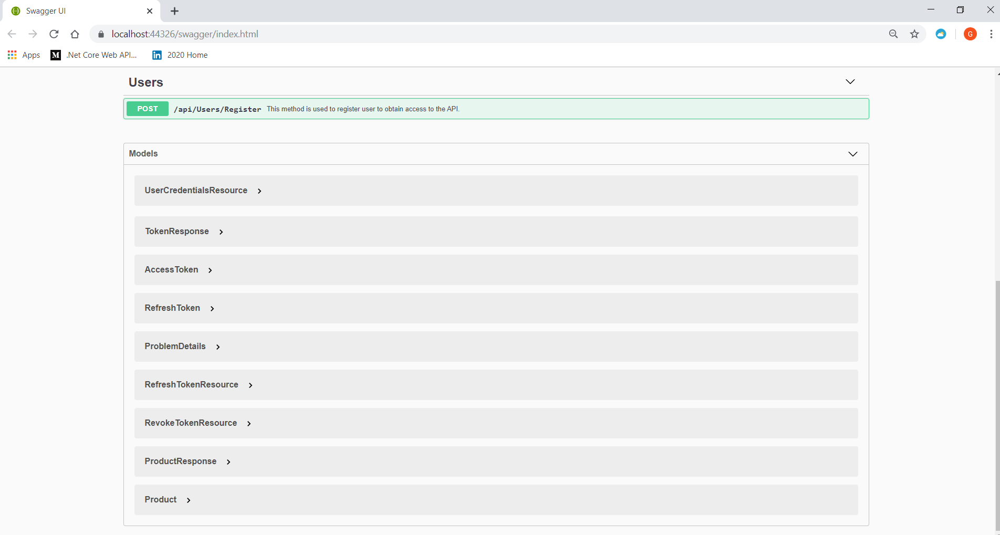
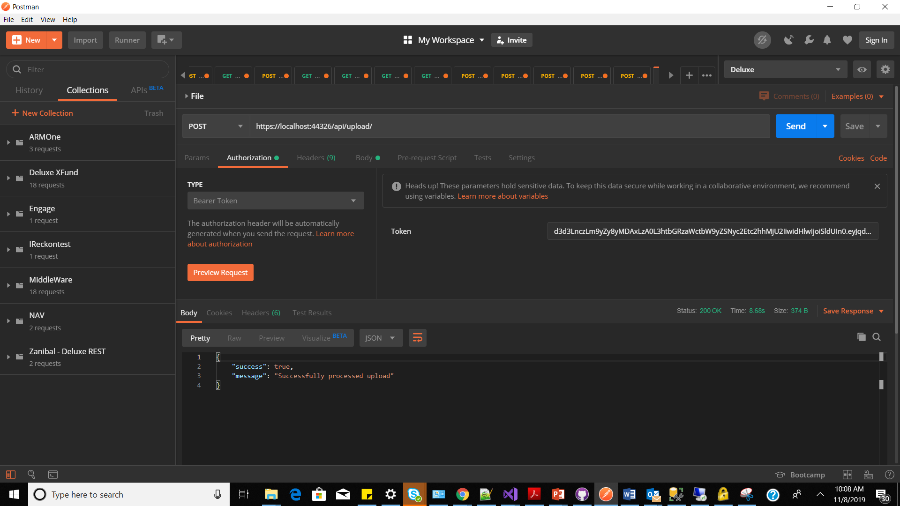

# IReckonu File Handler API

Simple RESTful API built with ASP.NET Core 2.2 that allows web applcations to import files via web API. JSON Web Token authentication and authorization was also implemened to protect access to endpoints. 

The Repository Pattern was used to manage data from the database, isolating the database access from the rest of the application. The request-response pattern was also used to encapsulate our request and response parameters into classes as a way to encapsulate information that our services will use to process some task and to return information to the client that is using the service.


# Features

## API User Management
 - User registration
 - Login via access token creation
 - Refresh tokens, to create new access tokens when access tokens expire
 - Revoking refresh tokens

## Product Management
 - Upload product File
 - Fetch product details

 
   
 # Frameworks and Libraries

The API uses the following libraries and frameworks to deliver the functionalaties described above:
 - [Entity Framewok Core](https://github.com/aspnet/EntityFrameworkCore) (for data access)
 - [ASP.NET Core 2.2](https://docs.microsoft.com/pt-br/aspnet/core/?view=aspnetcore-2.2)
 - [Entity Framework In-Memory Provider](https://docs.microsoft.com/en-us/ef/core/miscellaneous/testing/in-memory) (for testing purposes)
 - [NLog](https://github.com/NLog/NLog.Web/wiki/Getting-started-with-ASP.NET-Core-2)  (for logging)
 - [Swagger](https://swagger.io/) (for documentation)
  

# How to Test


```sh
1. git clone https://github.com/SirGidy/IReckonu.git

2. Run code from your preferred IDE 

```

3. Navigate to https://localhost:44326/swagger/index.html to cosume endpoints






To consume protected endpoints, you will need to create a user, login to obtain access token and then pass the access token in the authorization header while consuming the endpoints. I will recommend you use [Postman](https://www.getpostman.com/).

### Creating users

To create a user, make a post request to `http://localhost:44326/api/Users/Register` specifying a valid e-mail and password. The result will be a new user with common users permission.

```
{
	"email": "mytest@mytest.com",
	"password": "123456"
}
```

#### Requesting access tokens

To request access tokens, make a post request to `http://localhost:44326/api/login` sending a JSON object with user credentials. The response will be a JSON object with:

 - An access token which can be used to access protected API endpoints;
 - A request token, necessary to get a new access token when an access token expires;
 - A long value that represents the expiration date of the token.
 
 Access tokens expire after 300 seconds, and refresh tokens after 600 seconds (you can change it in `appseting.json`).


#### Refreshing tokens

To refresh a token, make a POST request to `http://localhost:44326/api/token/refresh` passing a valid refresh token and the user's e-mail in the body of the request.

```
{
	"token": "your_valid_refresh_token",
	"userEmail": "user@email.com"
}
```

You will receive a new token if the specified refresh token and e-mail are valid:


If the request token is invalid, you will receive a 400 response:


#### Revoking refresh tokens

Now imagine you want the user to sign out, or you want to revoke a refresh token by any reason. You can revoke a refresh token making a POST request to `http://localhost:8000/api/token/revoke`, passing a valid refresh token into the body of the request.

```
{
	"token": "valid_refresh_token"
}
```

You will get a `204 No Content` response after calling this endpoint.


### Accessing Protected Endpoints
To access a protected endpoint, kindly specify the access token in the Authorization header as shown below on postman 




Happy testing !!!
